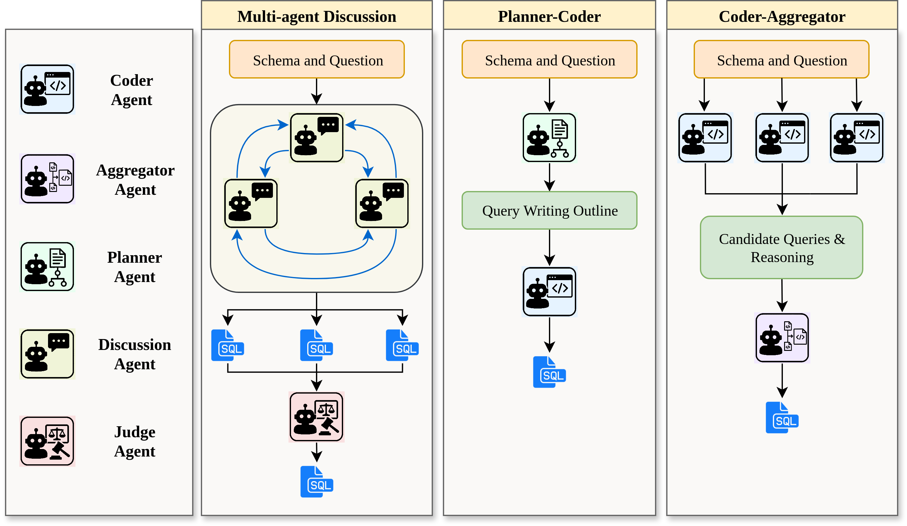

# BAPPA: Bridging Agents, Plans, and Pipelines for Automated Text-to-SQL Generation



Text-to-SQL systems provide a natural language interface that can enable even laymen to access information stored in databases. However, existing Large Language Models (LLM) struggle with SQL generation from natural instructions due to large schema sizes and complex reasoning. Prior work often focuses on complex, somewhat impractical pipelines using flagship models, while smaller, efficient models remain overlooked. In this work, we explore three multi-agent LLM pipelines, with systematic performance benchmarking across a range of small to large open-source models: (1) Multi-agent discussion pipeline, where agents iteratively critique and refine SQL queries, and a judge synthesizes the final answer; (2) Planner-Coder pipeline, where a thinking model planner generates stepwise SQL generation plans and a coder synthesizes queries; and (3) Coder-Aggregator pipeline, where multiple coders independently generate SQL queries, and a reasoning agent selects the best query.

## Installation and Usage 
```bash
git clone https://github.com/treeDweller98/bappa-sql.git

cd bappa-sql

python3.13 -m venv .venv
source .venv/bin/activate

pip install pandas wandb func_timeout gdown vllm==v0.8.5.post1

# Download datasets and place them in data/
...

# Add API WANDB_API key and HF_TOKEN in secrets.env
...

# Modify configurations in run_exp.sh
...

bash run_exp.sh
```

## Citation
Please cite our work using:

```bibtex

```

## License
[](LICENSE)

This project is licensed under the Apache 2.0 License - see the [LICENSE](./LICENSE) file for details.